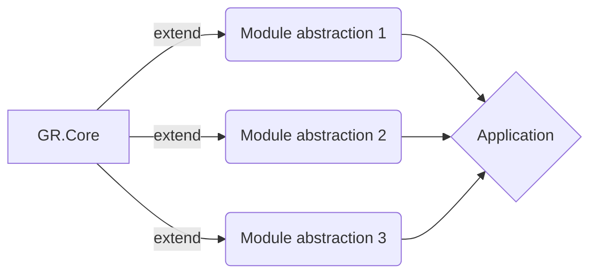

# GR.Core Module
## Description
Core is a module that contains interfaces, abstract classes, extensions, validations, helpers, it is the module that the other modules should extend

## Install
- Package manager
```console
Install-Package GR.Core -Version 1.9.3
```
- .net cli
```console
dotnet add package GR.Core --version 1.9.3
```
- Package reference
```csharp
<PackageReference Include="GR.Core" Version="1.9.3" />
```
- Packet cli
```console
paket add GR.Core --version 1.9.3
```
## Module usage

## Abstractions
- `IBackgroundTaskQueue` - interface that is used for push tasks to be executed in background
- `IBaseModel` - interface that has all BaseModel fields, can be used on classes that use inheritance from another classes that BaseModel
- `IBase<T>` - represent IBaseModel with genric type of entry id
- `IDbContext` - this interface is the database context of module, each DbContext must implement this interface
- `ISender` - represent a generic sender of messages, it can send anything, it depend on registered providers
- `IWritableOptions` -  custom implementation of IOptionsSnapshot<T> , has a method to update app settings configurations

## BaseModel class
BaseModel is the base class for entities that use EF Core
Structure of this class can be found below
```csharp

    public abstract class BaseModel : IBase<Guid>
    {
        /// <summary>
        /// Constructor. Initialize object with default values. A unique Id, Creation time and set IsDeleted to false
        /// </summary>
        protected BaseModel()
        {
            Id = Guid.NewGuid();
            Created = DateTime.UtcNow;
            Changed = DateTime.UtcNow;
        }

        /// <summary>Stores Id of the Object</summary>
        public Guid Id { get; set; }

        /// <inheritdoc />
        /// <summary>Stores Id of the User that created the object</summary>
        public virtual string Author { get; set; }

        /// <inheritdoc />
        /// <summary>Stores the time when object was created</summary>
        public DateTime Created { get; set; }

        /// <inheritdoc />
        /// <summary>
        /// Stores the Id of the User that modified the object. Nullable
        /// </summary>
        public virtual string ModifiedBy { get; set; }

        /// <inheritdoc />
        /// <summary>Stores the time when object was modified. Nullable</summary>
        public DateTime Changed { get; set; }

        /// <inheritdoc />
        /// <summary>
        /// Stores state of the Object. True if object is deleted and false otherwise
        /// </summary>
        public virtual bool IsDeleted { get; set; }

        /// <inheritdoc />
        /// <summary>
        /// Version of data
        /// </summary>
        public virtual int Version { get; set; }

        /// <inheritdoc />
        /// <summary>
        /// Tenant id
        /// </summary>
        public virtual Guid? TenantId { get; set; }

        /// <summary>
        /// Disable audit tracking
        /// This only work on current instance,
        /// The true value ignore save a new version on audit
        /// </summary>
        [JsonIgnore]
        [NotMapped]
        public virtual bool DisableAuditTracking { get; set; }

        /// <summary>
        /// Get props name
        /// </summary>
        /// <returns></returns>
        public static IEnumerable<string> GetPropsName()
        {
            return typeof(BaseModel).GetProperties().Select(x => x.Name).ToList();
        }
    }
```

## Attributes

## Events

## Exceptions

## Extensions 
- AssemblyExtensions
    - `GetTypeFromAssembliesByClassName` - get type by name from all assemblies
    - `GetAutoMapperProfilesFromAllAssemblies` - get all AutoMapper mappers from all assemblies
- BoolExtensions
    - `Negate` - negate boolean value
- CollectionExtensions
    - `AddRange` - add range items in HashSet, ICollection 
    - `Replace` - replace item in generic list
    - `DistinctBy` - get items distinct by a object propriety
    - `Join` - join a list of strings
    - `IsLast` -  return true if item is the last in collection
    - `IsFirst` - check if is first item
    - `GetDifferences` - get differencesfrom 2 lists
    - `ContainsAny` - check if list is contained in another
    - `AnyStartWith`- check if list has any items that start with a string
    - `ToKeyValuePair`- transform to KeyValuePair dictionary
    - `ToObservableCollection` - transform collection to an observable
    - `Randomize` - randomize items in a collection
    - `Transpose` - transpose collection
    - `ToCollection` - IEnumerable to Collection
    - `Combinations` - Returns all combinations of a chosen amount of selected elements in the sequence.
- CryptoExtensions
    - `EncryptWithRSA` - Encrypt a string using the supplied key. Encoding is done using RSA encryption.
    - `DecryptWithRSA` - Decrypt a string using the supplied key. Decoding is done using RSA encryption.
- DateTimeExtensions
    - `EndOfDay` - Get end of day
    - `StartOfDay` - Start of day
    - `DayIndex` - Day of week
    - `Intersects` - Intersects dates
    - `IsWeekend` - Check if is weekend
    - `Age` - Get the age of person
    - `IsLeapYear` - Returns whether or not a DateTime is during a leap year.
    - `DisplayTextDate` - Display text date
    - `CreatedThisWeek` - query to get items created this week
    - `CreatedThisMonth` - query to get items created this month
    - `CreatedToday` - query to get items created today
    - `CreatedOneHour` - query to get items created one hour
    - `CreatedThisYear` - query to get items created this year
    - `ToTimeStamp` - Date to time stamp 
## Helpers
1. `ZipHelper`
    ZipHelper is a helper that use ZipArchive and create an archive from a Dictionary<string, MemoryStream> , first arg is name of file and the second is stream of file, the result is a stream.
    Example:
    ```csharp
     var items = new Dictionary<string, MemoryStream>();
     MemoryStream archive = ZipHelper.CreateZipArchive(items);
    ```
    Example of return File in controller:
    ```csharp
     return File(archive, ContentType.ApplicationZip, "archive_name");
    ```
2. `EncryptHelper`
This helper is created for encrypt and decrypt anything , encryption is due grace a pass phrase.
Example: 
```csharp
//Encryption
 var serializedCard = cards.SerializeAsJson();
 var key = GenerateKey(user);
 var encrypted = EncryptHelper.Encrypt(serializedCard, key);
 
 //Decryption
  var serializedString = EncryptHelper.Decrypt(cardHash, key);
  var cards = serializedString.Deserialize<IEnumerable<CreditCardPayViewModel>>();
```
3. `MimeTypes` 
Contains all popular mime types, example of a record:
```csharp
{".ez", "application/andrew-inset"}
```
4. `MimeMapping`
This module maps document extensions to Content Mime Type.
Example:
```csharp
var getType = MimeMapping.GetMimeMapping(fileName);
```
5. `ModelBinders`
ModelBinders is a .net core feature that allow us to map property on HttpRequest serialization, for more info check [microsoft docs](https://docs.microsoft.com/en-us/aspnet/core/mvc/advanced/custom-model-binding?view=aspnetcore-2.2](https://docs.microsoft.com/en-us/aspnet/core/mvc/advanced/custom-model-binding?view=aspnetcore-2.2))
- `GearBinder<TValue>` - Custom generic binder
Example:
```csharp
public class ProductsFilterRequest
    {
        public virtual int Page { get; set; } = 1;
        public virtual int PerPage { get; set; } = 10;

        [ModelBinder(BinderType = typeof(GearBinder<IEnumerable<CommerceFilter>>))]
        public virtual IEnumerable<CommerceFilter> Filters { get; set; }
    }
```
- `GearDictionaryBinder<TValue>` - custom generic binder for dictionary
6.  `Singleton<T, TResolver>` - is an implementation of singleton pattern that allow to use it in a short mode, if value is null, it create automatically a default constructor instance.
Example:
```csharp
 public static IWindsorContainer Container => Singleton<IWindsorContainer, WindsorContainer>.Instance;
```
7.  `Arg` validator is a helper that throw an exception if argument not correspond to criteria, list of methods:
- NotNull
- NotNullOrEmpty
- InRange
- LessThan
- LessThanOrEqualTo
- GreaterThan
- GreaterThanOrEqualTo
Example:
```csharp
        public static void Register(string name, Type type)
        {
            Arg.NotNullOrEmpty(name, nameof(Register));
            Arg.NotNull(type, nameof(Register));
            Storage.TryAdd(name, type);
        }
```
8. `EnumHelper` 
It has a method to get the description value from attribute of enum:
Example:
```csharp
 var result = await _service.DeleteReportAsync(id);
 result.Result = ResultMessagesEnum.DeleteSuccess.GetEnumDescription();
```
9. `ExceptionHandler` it contains extensions for enumto transform to ResultModel
Example:
```csharp
ResultMessagesEnum.FolderNotSaved.ToErrorModel<Guid>();
```
10. `GearPolicy` - is a helper that execute and retry task in case of an error, it use Policy from Poly library
Example: 
```csharp
//if the first execution return an error, it retry 3 times with time delay
 var depositRequest = await GearPolicy.ExecuteAndRetry(async ()
                => await _coinbaseProClient.DepositsService.DepositFundsAsync(paymentMethod, amount, Currency.USD));
```
11. `IoC` - is an inversion of control helper that extend Castle Windsor Container
Available methods:
- `void RegisterService<TAbstraction>(string providerName, Type provider) where TAbstraction : class`
- `void RegisterSingletonService<TAbstraction>(string providerName, Type provider) where TAbstraction : class`
- `void RegisterTransientService<TAbstraction>(string providerName, Type provider) where TAbstraction : class`
- `void RegisterTransientService<TAbstraction, TImplementation>() where TImplementation : class, TAbstraction where TAbstraction : class`
- `void RegisterTransientService<TAbstraction, TImplementation>(TImplementation instance) where TImplementation : class, TAbstraction where TAbstraction : class`
- `void RegisterTransientService<TAbstraction, TImplementation>(string providerName) where TImplementation : class, TAbstraction where TAbstraction : class`
- `void RegisterSingletonService<TAbstraction, TImplementation>() where TImplementation : class, TAbstraction where TAbstraction : class`
- `void RegisterSingletonService<TService>() where TService : class`
- `void RegisterServiceCollection(Dictionary<Type, Type> toMapCollection)`
- `void RegisterScopedService<TAbstraction, TImplementation>(TImplementation instance) where TImplementation : class, TAbstraction where TAbstraction : class`
- `void RegisterScopedService<TAbstraction, TImplementation>() where TImplementation : class, TAbstraction where TAbstraction : class`
- `void RegisterService<TAbstraction, TImplementation>(Func<ComponentRegistration<TAbstraction>, ComponentRegistration<TAbstraction>> configuration)`
- `bool IsServiceRegistered<TService>()`
- `bool IsServiceRegistered(string provider)`
- `TService Resolve<TService>()`
- `TService ResolveNonRequired<TService>()`
- `TService ResolveNonRequired<TService>(string key)`
- `T Resolve<T>(string key)`
- `object Resolve(Type type)`
Example:
```csharp
// register IAuditManager  audit manager implementation
 IoC.RegisterTransientService<IAuditManager, TManager>();
// Resolve IConfiguration  instance
 var configurator = IoC.Resolve<IConfiguration>();
```
12. `JsonParser` - is a helper for read json files
Available methods:
- `T ReadArrayDataFromJsonFile<T>(string filePath) where T : class`
- `IEnumerable<dynamic> ReadDataListFromJsonWithTypeParameter(string filePath, Type entity)`
- `T ReadObjectDataFromJsonFile<T>(string filePath) where T : class`
Example:
```csharp
 var path = Path.Combine(AppContext.BaseDirectory, "Configuration/WidgetGroups.json");
 var items = JsonParser.ReadArrayDataFromJsonFile<ICollection<WidgetGroup>>(path);
```
13. `ObjectIdentificationHelper` - is a helper for check object type
Available methods:
- `bool IsList(this object o)`
- `bool IsDictionary(this object o)`
- `bool IsInt(this string sVal)`
- `bool IsNumeric(this string sVal)`
Example:
```csharp
if (!jObject.ContainsKey(_section))
            {
                jObject.Add(sectionObject.IsList()
                    ? new JProperty(_section, new JArray(JArray.Parse(JsonConvert.SerializeObject(sectionObject))))
                    : new JProperty(_section, new JObject(JObject.Parse(JsonConvert.SerializeObject(sectionObject)))));
            }
            else
            {
                if (sectionObject.IsList())
                    jObject[_section] = JArray.Parse(JsonConvert.SerializeObject(sectionObject));
                else
                    jObject[_section] = JObject.Parse(JsonConvert.SerializeObject(sectionObject));
            }
```
14. `ResourceProvider` - get app settings file path, in dependency of app environment: [Development, Production, Staging] 
Example:
```csharp
//The result can be appsettings.json
ResourceProvider.AppSettingsFilepath(hostingEnvironment))
```
15. `ResultModel<T>` - is a common return type for api and methods, it allow easy to check status of response and read the errors, it also contains helpers that allow easy understand the failure.
Examples: 
```csharp
 public static async Task<ResultModel> UploadAsync(this IFormFile file, string filePath)
        {
            var result = new ResultModel();
            try
            {
                using (var stream = File.Create(filePath))
                {
                    await file.CopyToAsync(stream);
                }

                result.IsSuccess = true;
            }
            catch (Exception e)
            {
                result.AddError(e.Message);
            }

            return result;
        }
```
## Services
1. `WritableOptions<T>` - default implementation of IWritableOptions<T>

## Global settings

## GearApplication instance

## Mappers

### AutoMapper
AutoMapper is supported directy from Core, created profiles are automatically scanned and registered, only that is need is to create your profile class.
Example of profile:
```csharp
public class OrganizationProfile : Profile
{
    public OrganizationProfile()
    {
        CreateMap<Foo, FooDto>();
        // Use CreateMap... Etc.. here (Profile methods are the same as configuration methods)
    }
}
```

### Mapster
Mapster is a library that support mapping type to another type, it has extensions for object type, sample example:
```csharp
var user= new User();
var ldapUser = user.Adapt<LdapUser>();
```

More docs coming soon